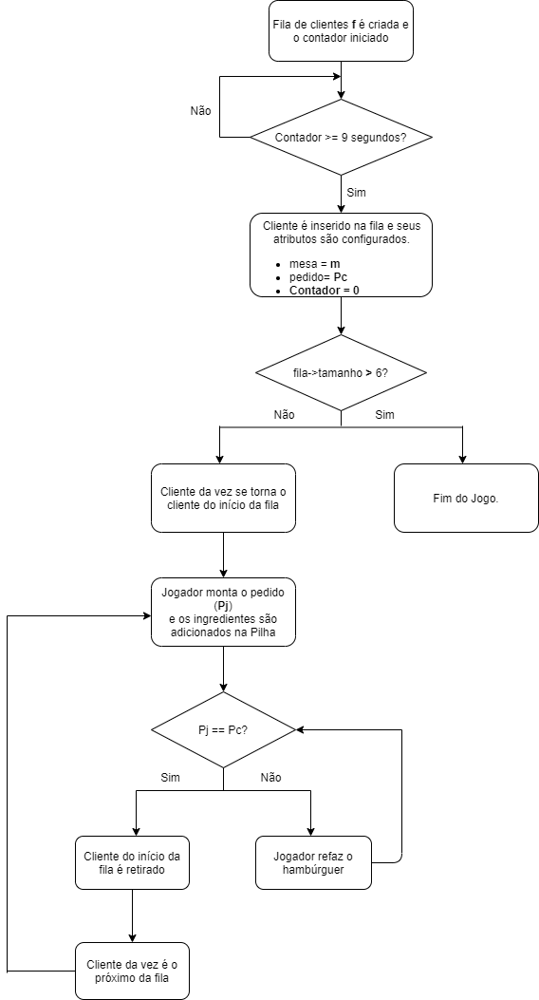

# Hamburgueria

Este é um jogo criado por Vinicius Negrelli e Gustavo Schaefer. O jogo tem como objetivo aplicar os conteúdos aprendidos na disciplina, além utilizar a biblioteca gráfica **SFML em C/C++** afim de criar a interface pra o usuário. 

## Demo

<div align="center">

<p>Demonstração do jogo</p>
</div>

## Sumário

- [Introdução](#introdução)
	- [Sinopse do jogo](#sinopse)
- [Descrição do problema](#descrição-do-problema)
	- [Estratégia de resolução](#estratégia-de-resolução)
	- [Cardápio](#cardápio)
	- [Soluções já existentes](#soluções-já-existentes)
- [Relação dos conceitos com a matéria](#relação-dos-conceitos-com-a-matéria)
    - [Pilha](#pilha)
    - [Fila](#fila)
    - [Recursão](#recursão)
- [Fluxograma](#fluxograma)
- [Descrição do fluxograma](#descrição-do-fluxograma)


## Introdução 

O projeto constitui em um jogo que simula o ambiente de uma hamburgueria, focando principalmente no fluxo de pedidos, feitos de maneira arbitraria pelos clientes (computador), e na montagem dos hamburguers. 

As principais motivações para a construção do projeto foram a demonstração de como estruturas de dados estão implicitamente presentes no cotidiano, e de como a otimização do pipeline de tarefas complexas pode ocorrer com a estrutura de dados apropriada, dependendo da situação e aplicabilidade dos dados. 

Como o ambiente de um restaurante é dinâmico, torna-se necessário utilizar estratégias para lidar com a quantidade de pedidos e clientes de forma rápida, mantendo a organização e respeitando a ordem correta das solicitações. Além disso, é imprescindível garantir que cada cliente receba seu hamburguer da mesma maneira que o pediu. Por este motivo, estruturas de dados são tão aplicáveis no projeto "Hamburgueria", já que com o auxílio delas há um ganho de velocidade e organização de tarefas trabalhosas.

Abaixo encontra-se uma sinopse do jogo, mais voltada para o jogador.

### Sinopse

Você já passou por uma situação em que pede o seu sanduiche sem picles e parece que o atendende ouviu que você queria o DOBRO de picles? Ou a fila de clientes era tão imensa que o pedido demorou uma eternidade pra chegar? Eis a solução! Esse jogo foi criado para preparar e capacitar os atendentes para que o seu sanduiche seja preparado rapidamente e montado de maneira impecável!

Seu objetivo é montar o sanduiche escolhido pelo cliente exatamente como foi pedido, e evitar que a fila de clientes chegue ao limite de pessoas. Tente entregar o maximo de pedidos que conseguir, antes que a aglomeração tome conta do seu restaurante. Sabendo disso, pegue seu avental, coloque suas luvas e prepare-se pra enfrentar o caos e o desespero.

É sempre bom lembrar que pedir um "hambúrger" deixa implícito que você quer carne no meio do pão, isto é, 
pedir um hambúrger com bacon e tomate implica em um hambúrger, bacon e tomate entre dois pães.


## Descrição do problema

Para criação do projeto, foram utilizadas duas estruturas de dados diferentes, sendo elas **Pilha** e **Fila**, além de **Recursão**. 

Durante o jogo, os clientes são gerados de maneira constante dentro de um intervalo de tempo de **9 segundos**, e este processo só acaba quando um número limite de **6 clientes** na fila de espera for atingido (o cliente da vez e mais 5 clientes na fila), ou seja, o restaurante está cheio e não há mais espaço para novos clientes. Portanto, o problema geral do projeto é lidar de maneira dinâmica com a entrada e saida de elementos (clientes) em uma fila, e trabalhar com a manipulação de dados em uma pilha (ingredientes do hamburguer).

Vale lembrar que todos os clientes gerados possuem um pedido, representado inicialmente por um número entre 1 e 20 (total de opções de hamburguer do restaurante) e que esses pedidos são feitos de maneira aleatória pelo programa.

### Estratégia de resolução

A estratégia de resolução do problema segue os seguintes passos:

1.	O cliente possui uma estrutura, contendo informações sobre seu pedido e a sua mesa. A medida em que o tempo passa, novos clientes são gerados.

2.	Quando um novo cliente for gerado, ele é posicionado em uma das mesas disponíveis, faz seu pedido, e entra na fila de espera até que seu hamburguer seja entregue.

3.	Para realizar o pedido, o cliente tem 20 opções diferentes de hamburguer. O programa utiliza a biblioteca ```time.h``` para gerar um número aleatório entre 1 e 20, e a partir desse número, o pedido é mapeado dentro do cardápio.

4.	O pedido do primeiro cliente da fila chega ao jogador, e ele o monta com os mesmos ingredientes solicitados, mas **não necessáriamente na mesma ordem**. O único pré requisito é que exista um pão na base e outro no topo do hambúrguer, pois só assim o jogo vai entender que o pedido foi feito e está disponível para entrega.

5.	Feita a montagem, o pedido é entregue na mesa do respectivo cliente. Se o hamburguer feito pelo jogador é igual ao solicitado, o cliente sai da fila de espera e o próximo freguês é atendido. 

6.	Como os clientes são gerados continuamente, o processo descrito acima é repetido até que o jogador perca o jogo (mais de 5 clientes na fila de espera), e então é mostrado a ele qual foi o número total de mesas antendidas corretamente.

### Cardápio

Como já dito, existem 20 opções disponiveis no cardápio. Cada opção foi criada **manualmente** por nós, e é composta pelos pães, hambúrguer e adicionais como queijo, tomate, picles, etc. Existem três tipos de sabor de carne para o pedido:

- Carne
- Peixe
- Frango

A lista de ingredientes aparece para o jogador na tela principal do jogo:


<div align="center">

<p>Ingredientes</p>
</div>

Cada um desses ingredientes é representado por um número inteiro 2^n (1, 2, 4, 8, ..., 256).

* Queijo cheddar (Ch) = 1
* Queijo suiço (S) = 2
* Tomate (T) = 4 
* Picles (Pi) = 8
* Alface (A) = 16
* Hambúrguer de **carne** (Cr) = 32
* Hambúrguer de **frango** (F) = 64
* Hambúrguer de **peixe** (Px) = 128
* Bacon (B) = 256

Já o **pão** possue valor 0.

Portanto, o valor do pedido completo é a soma dos ingredientes que o compoem. Por exemplo, um hambúrguer de carne com alface, tomate, picles, cheddar e bacon é a soma:

0 (Pães) + 32 (hambúrguer de carne) + 16 (alface) + 4 (tomate) + 8 (picles) + 1 (cheddar) + 256 (bacon) = 
**317** (Valor do pedido) 

Logo, cada uma das 20 opções é representada por um número inteiro (soma dos ingredientes escolhidos) que foi feita de maneira que nenhuma opção fosse igual. Utilizando a funcão ```srand(time(NULL))``` é possível gerar um número aleatório entre 1 e 20 (```int r = (rand() % 20) + 1```). Após isso, o número é mapeado com um dos pedidos possíveis do cardápio.

* 1 	===>	62 **(Cr + S + T + A + P)**
* 2 	===>	54 **(Cr + S + T + A)**
* 3 	===> 	37 **(Cr + Ch + T)**
* 4 	===>	58 **(Cr + S + Pi + A)**
* 5 	===>	89 **(F + Ch + A + Pi)**
* 6 	===>	86 **(F + S + A + T)**
* 7 	===>	93 **(F + C + A + T + Pi)**
* 8 	===>	74 **(F + S + Pi)**
* 9 	===>	30 **(A + T + P + S)**
* 10 	===>	109 **(F + Cr + T + Pi + C)**
* 11 	===>	142 **(Px + S + Pi + T)**
* 12	===>	153 **(Px + A + Pi + Ch)**
* 13	===>	404 **(Px + B + T + A)**
* 14	===>	297 **(Cr + B + Ch + Pi)**
* 15	===>	338 **(F + B + S + A)**
* 16 	===>	509 **(Px + Cr + F + B + Pi + Ch + A + T)**
* 17	===>	119 **(Cr + F + S + Ch + A +T)**
* 18	===>	480 **(F + Cr + Px + B)**
* 19	===>	150 **(Px + A + T + S)**
* 20	===>	171 **(Px + Pi + Cr + S + Ch)**

### Soluções já existentes

Não encontramos nenhum jogo similar ao nosso, e portanto nenhuma solução pré existente para o problema. Apenas nos baseamos nos conteúdos aprendidos em sala de aula e tentamos aplicar tudo de uma maneira criativa e eficiente.


## Relação dos conceitos com a matéria

Como dito acima, dois tipos diferentes de estrutura de dados foram usados, cada uma desempenhando um papel específico no fluxo de funcionamento do programa. Abaixo é descrito detalhadamente o motivo da utilização de cada uma.

### Pilha 

O principal motivo para a utilização da pilha foi a **montagem do hamburguer**.

Como pilhas são caracterizadas por uma estrutura de dados em que o **último dado inserido é o topo**, decidimos utilizá-las como responsáveis na montagem dos hambúrguers, pois os ingredientes são empilhados de maneira coerente, sempre um pão na base, ingredientes no meio, e outro pão no topo. Dessa maneira não há como modificar o pedido em suas partes intermediarias, e sempre que um pão for o topo da pilha, ou a montagem do pedido foi iniciada ou o pedido foi finalizado.

Outro fator importante é que **não importa qual a ordem dos ingredientes**, desde que exista um pão na base e um no topo, no meio deles o jogador pode fazer o hambúrguer inserindo os ingredientes em qualquer ordem, desde que **sejam os mesmos ingredientes do pedido**. Como cada ingrediente é um número inteiro, podemos apenas somar o valor de cada um no hambúrguer feito pelo player e comparar com valor do pedido feito pelo cliente, se as somas forem iguais, o pedido foi feito corretamente, senão o jogador deverá refazer o hambúrguer.

Como hambúrguer é representado por uma pilha, não há como remover um ingrediente que foi colocado erroneamente durante a montagem do pedido. Portanto, se o jogador perceber que inseriu algum ingrediente errado enquanto montava o pedido, a única opção é apagar tudo e recomeçar. Para isso, há um botão no canto infeior esquerdo com formato de lixeira que exclui todo o atual progresso de montagem.

### Fila

O principal motivo para a utilização da fila foi **ordenação dos clientes**.

Filas são essênciais, pois como os pedidos devem ser feitos e entregues para o **primeiro** cliente que faz a solicitação (início da fila), há um gerenciamento de como está o andamento do restaurante, pois podemos saber o tamanho da fila e qual é o cliente da vez. Ao escolher sua mesa e realizar o pedido, o cliente fica na fila aguardando, já que muito provavelmente outros clientes já haviam chegando antes dele, e possuem prioridade de entrega por estarem em posições mais avançadas na espera. Na medida em que os hambúrguers são entregues, **o próximo da fila deve ser o próximo cliente atendido**, e assim até que o jogo acabe.

Para saber quantos clientes tem na fila, existe um sinalizador abaixo da descrição do pedido. Na medida em que novos clientes vão chegando, esse número aumenta, indicando que o jogador deve ser apressar ou senão vai perder o jogo.

A tela padrão do jogo é mostrada abaixo. 

<div align="center">

<p>Demonstração da tela do jogo e seus botões</p>
</div>

### Recursão

A recursão foi usada apenas para **impressão do hambúrguer**, e é iniciada logo quando a pilha começa ser montada. Desse modo, a cada ingrediente que o jogador arrasta para montar o pedido, é utilizado recursão para **atualizar o que está sendo mostrado na tela**, tornando o jogo dinâmico. Se não fosse utilizado recursão, as camadas seriam impressas na ordem inversa.

Abaixo é mostrado um exemplo de um hambúrguer sendo impresso dinâmicamente usando recursão.

<div align="center">

<p>Recursão sendo utilizada para imprimir o hambúrguer</p>
</div>


## Fluxograma

O fluxograma a seguir descreve a lógica de funcionamento do programa, detalhando o passo a passo da resolução do problema.

<div align="center">

<p>Fluxograma do jogo Hamburgueria</p>
</div>


## Descrição do fluxograma

O primeiro passo lógico é inicar a fila de clientes, que vai sendo modificada durante a partida. 
Como cada cliente é gerado a cada 9 segundos, o temporizador é iniciado, se o tempo passou, um novo cliente é inserido na fila e seus atributos são configurados:

* Sua mesa se torna uma das diponíveis
* Seu pedido é gerado de maneira aleatória

E então o temporizador é reiniciado. Entretanto, se durante o processo de montagem do hambúrguer o tempo chegar a 9 segundos, mais um cliente é adicionado, independente em que ponto de criação do pedido o jogador esteja.

Após cada inserção, é feita uma checagem do tamanho da fila de espera, e se ela atingir 6 clientes, o jogo acaba, independente do momento.

Se a fila ainda não chegou ao seu limite, o pedido a ser feito se torna o pedido do cliente no início da fila. O jogador monta o hambúrguer conforme o solicitado, colocando cada ingrediente por vez e assim a pilha do hambúrguer vai se modificando dinâmicamente. Quando o jogador finaliza a montagem do pedido (com no minimo um pão no base e um no topo da pilha de ingredientes), é feita uma comparação entre o valor do hambúrguer feito pelo player e o do hambúrguer solicitado pelo cliente. Se os dois valores não forem iguais, o jogador deve refazer o pedido até que fique certo.

Se o jogador montou o pedido corretamente, o cliente da vez sai da fila, e o próximo cliente é atendido (imediatamente o próximo na fila de espera). Após isso, o processo de montagem é feito novamente pelo jogador, continuando em um loop até que o jogo acabe.

É importante lembrar que a inserção de clientes na fila é feita constantemente no jogo, assim como a verificação do tamanho da fila, que é mostrada ao jogador para que ele tenha noção de como está o andamento do restaurante. 
